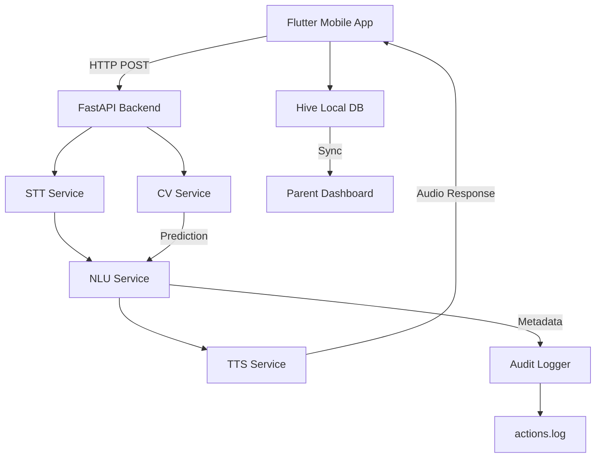

# 🏗️ Architecture Documentation - The Whispering Woods

## System Overview

The Whispering Woods uses a **modular pipeline architecture** ensuring safety, control, and speed for children's interactions.

---

## High-Level Architecture



---

## Component Details

### 1. Client Layer (Flutter)

**Location**: `mobile_app/lib/`

**Responsibilities**:
- Game logic and state management
- Audio capture (microphone)
- Drawing canvas
- Local storage (Hive)
- UI/UX rendering
- Offline fallback

**Key Files**:
- `main.dart` - App entry point
- `screens/` - UI screens
- `services/api_client.dart` - FastAPI client
- `services/game_service.dart` - Game state
- `services/storage_service.dart` - Hive database
- `widgets/ai_companion_widget.dart` - Companion UI

---

### 2. Backend Layer (FastAPI)

**Location**: `backend/app/`

**Architecture**: Modular pipeline

```
Request (Audio + Game State)
    ↓
[STT Service] → Text
    ↓
[NLU Service] → Response Key + Text
    ↓
[TTS Service] → Audio
    ↓
Response (Audio + Metadata)
```

#### STT Service (The Ear)

- **Purpose**: Convert child's speech to text
- **Model**: Whisper (fine-tuned for Egyptian Arabic)
- **Placeholder**: Returns canned transcriptions
- **Input**: Audio bytes (WAV/MP3)
- **Output**: Text + confidence

#### NLU Service (The Brain)

- **Purpose**: Understand intent and generate response
- **Type**: **Rule-based state machine** (deterministic, no LLMs)
- **Configuration**: `nlu_rules.yaml` (editable YAML)
- **Process**: Pattern matching → Response key → Text
- **Safety**: 100% controlled responses

#### TTS Service (The Mouth)

- **Purpose**: Convert response text to speech
- **Model**: XTTS/VITS (voice-cloned for character)
- **Placeholder**: Returns silence audio
- **Input**: Text + character type
- **Output**: Audio bytes (WAV)

#### CV Service (The Vision)

- **Purpose**: Recognize children's drawings
- **Model**: CNN trained on Quick, Draw! dataset
- **Placeholder**: Random predictions
- **Input**: Image bytes (PNG/JPEG)
- **Output**: Prediction + confidence + correctness

---

### 3. Data Flow

#### Adventure Speech Pipeline

```
1. Child speaks → Audio captured
2. Audio → Base64 encoded
3. POST /api/adventure_speech
   {
     "audio_base64": "...",
     "game_state": {...},
     "character_type": "bird"
   }
4. Backend:
   a. Decode audio
   b. STT: audio → text
   c. NLU: text + game_state → response_key + response_text
   d. TTS: response_text → audio
   e. Encode response audio to base64
5. Response:
   {
     "audio_base64": "...",
     "text_response": "...",
     "metadata": {...}
   }
6. Flutter plays audio
```

#### Drawing Recognition Pipeline

```
1. Child draws on canvas
2. Canvas → Image bytes
3. POST /api/draw
   {
     "image_base64": "...",
     "challenge": "DRAW_CAT"
   }
4. Backend:
   a. Decode image
   b. CV: image → prediction
   c. Compare prediction vs challenge
   d. Generate feedback (success/try again)
   e. If success → TTS: feedback → audio
5. Response:
   {
     "prediction": "cat",
     "is_correct": true,
     "text_response": "...",
     "audio_base64": "..."
   }
```

---

### 4. Storage Architecture

#### Client-Side (Flutter)

- **Hive Database** (local)
  - `game_progress` - Current game state
  - `interaction_logs` - All interactions
  - `settings` - User preferences

#### Server-Side

- **Audit Log** (`logs/actions.log`)
  - Append-only JSON logs
  - All API requests/responses
  - Privacy-respecting (no audio stored)

#### Optional (Future)

- **PostgreSQL** (if admin features needed)
  - Player accounts
  - Game statistics
  - Billing records

---

### 5. Safety Architecture

```
┌─────────────────────────────────────┐
│   Child Input                        │
└──────────────┬──────────────────────┘
               │
               ▼
┌─────────────────────────────────────┐
│   Safety Filter                      │
│   - Inappropriate word detection     │
│   - Content validation               │
└──────────────┬──────────────────────┘
               │
               ▼
┌─────────────────────────────────────┐
│   Rule-Based NLU                     │
│   - Deterministic responses only     │
│   - No generative LLMs               │
│   - YAML-editable rules              │
└──────────────┬──────────────────────┘
               │
               ▼
┌─────────────────────────────────────┐
│   Safe Response                      │
│   - 100% controlled                  │
│   - Age-appropriate                  │
└─────────────────────────────────────┘
```

**Key Principles**:
1. **No Generative LLMs** for core game logic
2. **Rule-based only** - All responses come from YAML rules
3. **Content filtering** - Inappropriate words blocked
4. **Offline-first** - Works without external APIs

---

### 6. Offline Architecture

When backend unavailable:

```
┌─────────────────────────────────────┐
│   Flutter App                        │
│   - Attempts API call                │
│   - Timeout/Error                     │
└──────────────┬──────────────────────┘
               │
               ▼
┌─────────────────────────────────────┐
│   Offline Handler                    │
│   - Detects network error            │
│   - Loads canned responses           │
└──────────────┬──────────────────────┘
               │
               ▼
┌─────────────────────────────────────┐
│   Local Response                     │
│   - Canned audio files               │
│   - Basic NLU rules                 │
│   - Logs to local queue              │
└─────────────────────────────────────┘
```

**Canned Responses**: Stored in `mobile_app/assets/voices/`

---

## API Endpoints

### Public Endpoints

- `POST /api/adventure_speech` - Main pipeline
- `POST /api/draw` - Drawing recognition
- `GET /api/health` - Health check

### Admin Endpoints (Protected)

- `POST /api/admin/stats` - Statistics
- `GET /api/admin/audit_log` - Audit logs
- `POST /api/billing/webhook` - Stripe webhook

---

## Request/Response Formats

### Adventure Speech Request

```json
{
  "audio_base64": "base64_encoded_audio",
  "audio_format": "wav",
  "game_state": {
    "state": "FOREST_ADVENTURE",
    "context": "puzzle_solving",
    "level": 1,
    "state_data": {}
  },
  "player_id": "player_123",
  "character_type": "bird"
}
```

### Adventure Speech Response

```json
{
  "audio_base64": "base64_encoded_response_audio",
  "audio_format": "wav",
  "text_response": "بص كويس جنب الشلال يا بطل!",
  "metadata": {
    "response_key": "NUMBER_HINT_1",
    "confidence": 0.9,
    "source": "nlu_rule",
    "transcribed_text": "مش عارف",
    "detected_emotion": "confusion",
    "processing_time_ms": 250.5
  },
  "timestamp": "2024-01-15T10:30:00Z"
}
```

---

## Performance Targets

- **STT**: < 1.5 seconds
- **NLU**: < 0.1 seconds (rule-based, very fast)
- **TTS**: < 2.0 seconds
- **CV**: < 0.5 seconds
- **Total Pipeline**: < 3.5 seconds

---

## Scalability Considerations

- **Horizontal Scaling**: FastAPI supports multiple workers
- **Caching**: Redis for frequently used responses (optional)
- **CDN**: For static assets and audio files (optional)
- **Load Balancing**: Nginx reverse proxy

---

## Technology Stack

- **Mobile**: Flutter 3.10+
- **Backend**: FastAPI 0.104+
- **AI Models**: 
  - Whisper (STT)
  - XTTS/VITS (TTS)
  - Custom CNN (CV)
- **Storage**: Hive (local), PostgreSQL (optional)
- **Deployment**: Docker, Docker Compose
- **CI/CD**: GitHub Actions

---

## Security Architecture

- **API Authentication**: Admin endpoints use API keys
- **Input Validation**: Pydantic schemas
- **CORS**: Configured for specific origins
- **Rate Limiting**: Per-endpoint limits
- **Audit Logging**: All actions logged
- **No PII Storage**: Audio/images not persisted without consent

---

## Future Enhancements

- [ ] Real-time WebSocket for live updates
- [ ] Multi-language support
- [ ] Advanced analytics dashboard
- [ ] Cloud model inference (GPU)
- [ ] A/B testing framework

---

**Last Updated**: 2024
**Version**: 1.0.0-alpha

